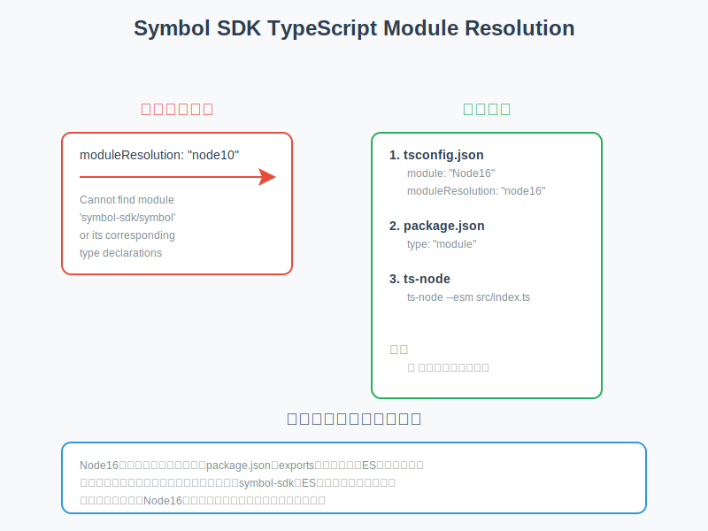

# symbol-sdk-v3-practice

## 秘密鍵の生成

おそらく symbol-sdk の中に秘密鍵生成用のメソッドがあると思われます。
new をしてインスタンス生成しようとして怒られて new をなくすと動いたので、その理由は以下になります。

このエラーは TypeScript の型チェックに関連しています。

エラーの原因を説明すると：

1. `new PrivateKey.random()`という構文が問題を引き起こしています
2. TypeScript は`PrivateKey.random()`をコンストラクタとして扱おうとしていますが、`random()`は静的メソッドとして定義されているはずです

正しい使い方は以下のようになります：

```typescript
import { PrivateKey } from "symbol-sdk";

const aliceKey = PrivateKey.random(); // newを使わない
console.log("Alice's private key:", aliceKey);
```

`new`を使う必要がない理由：

- `PrivateKey.random()`は新しい PrivateKey インスタンスを返す静的ファクトリメソッドです
- このメソッドは内部で既にオブジェクトの生成を行っているため、外部で`new`を使う必要はありません

これは一般的なデザインパターンの一つで、ファクトリメソッドパターンと呼ばれるものに近い実装です。

## TypeScript の設定

symbol-sdk を TypeScript プロジェクトで使用する際に、以下のようなエラーが発生する場合があります：

```
Cannot find module 'symbol-sdk/symbol' or its corresponding type declarations.
```

このエラーを解決するには、以下の設定が必要です：

### 設定の概要図



1. `tsconfig.json`の設定を更新：

```json
{
  "compilerOptions": {
    "module": "Node16",
    "moduleResolution": "node16"
  }
}
```

2. `package.json`で ES モジュールを有効化：

```json
{
  "type": "module"
}
```

3. ts-node で ES モジュールを使用する場合は、実行時に`--esm`フラグを追加：

```json
{
  "scripts": {
    "start": "ts-node --esm src/index.ts"
  }
}
```

これらの設定により、symbol-sdk の型定義が正しく解決され、TypeScript の型チェックが正常に機能するようになります。

## Symbol SDK のモジュール設計と実行時の設定について

Symbol SDK は最新の JavaScript/TypeScript のモジュールシステムを採用しており、ES モジュール（ECMAScript Modules）として実装されています。このモジュール設計により、より良い tree-shaking（未使用コードの除去）やパッケージの最適化が可能になっていますが、実行時に特別な設定が必要になります。

### なぜ ts-node で直接実行できないのか？


ts-node で直接実行できない理由は、以下の要因が組み合わさっているためです：

1. **Symbol SDK のモジュール形式**

   - Symbol SDK は ES モジュールとして実装されています
   - ES モジュールは`import/export`構文を使用し、静的な依存関係解析が可能

2. **デフォルトの ts-node 動作**

   - 通常の ts-node は CommonJS 形式（`require/module.exports`）として実行します
   - CommonJS と ES モジュール間の互換性の問題により、直接的な import が失敗します

3. **TypeScript のモジュール解決**
   - TypeScript のモジュール解決システムは、実行時の Node.js の動作とは異なる場合があります
   - コンパイル時と実行時で異なるモジュール解決方式が使用されると問題が発生

### なぜ--loader ts-node/esm オプションで動くのか？

このオプションが機能する理由は以下の通りです：

1. **ESM ローダーの有効化**

   ```json
   // package.json
   {
     "type": "module",
     "scripts": {
       "start": "node --loader ts-node/esm src/index.ts"
     }
   }
   ```

   - `type: "module"`により、プロジェクト全体が ES モジュールとして扱われます
   - `--loader ts-node/esm`は、TypeScript ファイルを ES モジュールとして正しく解釈します

2. **TypeScript の設定**

   ```json
   // tsconfig.json
   {
     "compilerOptions": {
       "module": "NodeNext",
       "target": "ESNext"
     },
     "ts-node": {
       "esm": true,
       "experimentalSpecifierResolution": "node"
     }
   }
   ```

   - `module: "NodeNext"`により、最新の Node.js のモジュール解決方式を使用
   - `experimentalSpecifierResolution: "node"`で、Node.js スタイルの解決を有効化

3. **実行時の動作**
   - ts-node/esm ローダーが TypeScript ファイルを検出
   - ES モジュールとしてトランスパイル
   - Symbol SDK の ES モジュールとして実装された機能を正しく import

この設定により、開発時の TypeScript の型チェックと実行時のモジュール解決の両方が正しく機能し、Symbol SDK を問題なく使用できるようになります。

![]


この SVG では、CommonJS と ES Modules の主な違いを以下のように表現しました：

1. 設計思想の違い:

- CommonJS はサーバーサイド（Node.js）に最適化され、動的な読み込みを重視
- ES Modules はブラウザでの JavaScript 実行を考慮し、静的解析や最適化を重視

2. 実装の特徴:

- CommonJS は`require/exports`を使用し、同期的な読み込みと動的な依存関係解決
- ES Modules は`import/export`を使用し、静的解析可能で非同期読み込みをサポート

3. モジュール解決の方法:

- CommonJS は実行時に依存関係を解決
- ES Modules はコンパイル時に依存関係を解決し、tree-shaking などの最適化が可能

この違いが、あなたが経験していた設定の問題の根本的な原因となっています。Symbol SDK が ES Modules 形式で実装されているため、CommonJS 形式で実行しようとすると互換性の問題が発生するのです。
