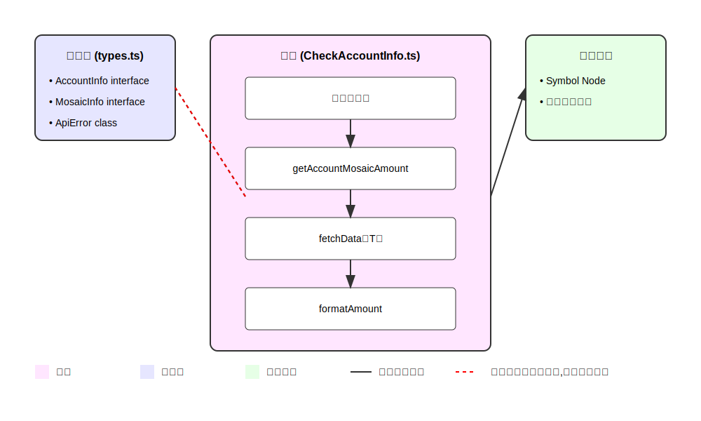

# CheckAccountInfo.ts の設計と関係性

## 関数の役割と関係性の解説

### 1. メイン処理

- エントリーポイントとして`getAccountMosaicAmount()`を実行
- エラーハンドリングとログ出力を担当

### 2. getAccountMosaicAmount()

- アカウントのモザイク情報を取得する主要な関数
- 処理フロー：
  1. アカウント情報の取得（fetchData を使用）
  2. モザイク情報の取得（fetchData を使用）
  3. 金額のフォーマット（formatAmount を使用）

### 3. fetchData<T>()

- Symbol Node API からデータを取得する汎用関数
- 特徴：
  - ジェネリック型を使用して柔軟なレスポンス型に対応
  - エラーハンドリングを内包
  - URL エンドポイントに応じて適切なレスポンスフィールドを選択

### 4. formatAmount()

- モザイク量を適切な小数点形式にフォーマットする純粋関数
- 可分性（divisibility）に基づいて数値を整形

## エラーハンドリング設計

ApiError クラスを使用した 3 層のエラーハンドリング：

1. fetchData 内での基本的なエラーハンドリング
2. getAccountMosaicAmount 内での業務ロジック関連のエラーハンドリング
3. メイン処理での最終的なエラーハンドリングとログ出力

## データの流れ

1. メイン処理が開始
2. getAccountMosaicAmount が呼び出され
3. fetchData を使用してアカウント情報を取得
4. 取得したアカウント情報から最初のモザイク ID を使用
5. そのモザイク ID を使用して再度 fetchData でモザイク情報を取得
6. formatAmount で最終的な表示形式に整形
7. 結果をコンソールに出力

この設計により、各関数は単一責任の原則に従い、かつ柔軟な拡張性を持つ構造となっています。
